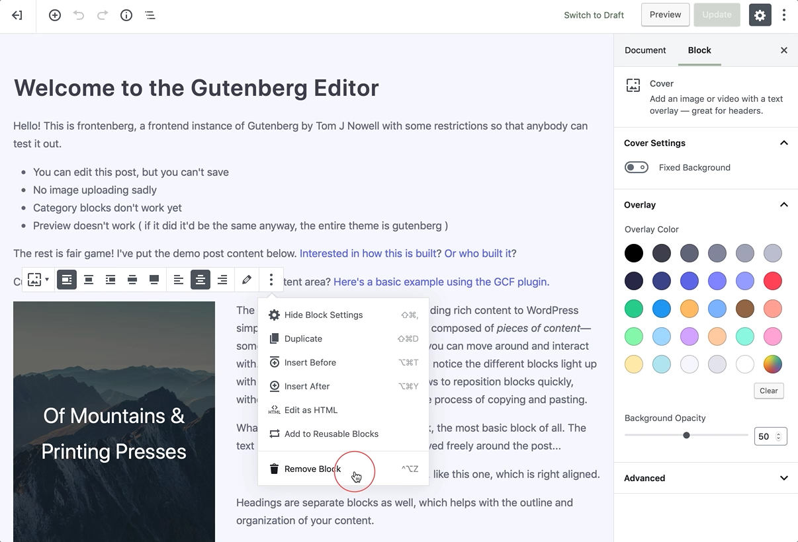

# Removing A Block

To remove a block, select the block and click the **three dots** right above it in the toolbar. Among the settings there you’ll see the option to remove or delete the chosen block.

