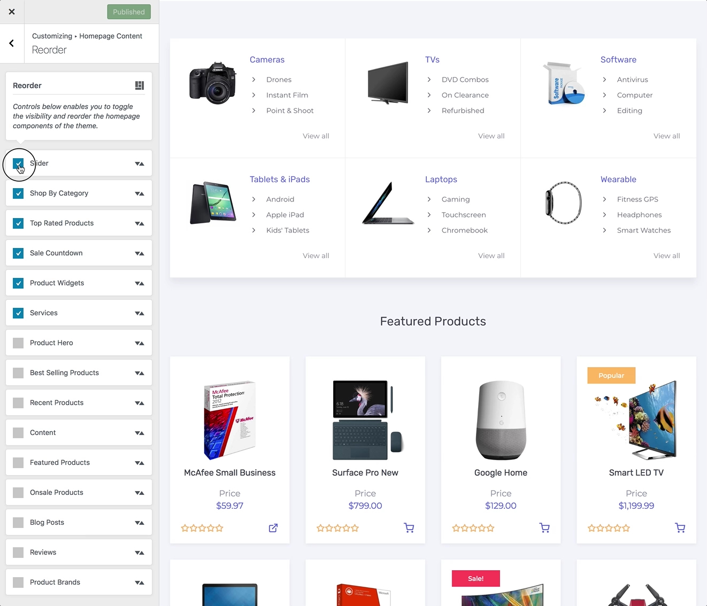

# Reordering Homepage Components

**Reorder** is a lightweight option that allows you to re-order or disable any of the homepage components added by the [Conj - eCommerce WordPress Theme](https://themeforest.net/item/conj-ecommerce-wordpress-theme/21935639?ref=mypreview).

1. On the frontend, in the **Admin bar**, click **Customize**.
2. On the backend, click **Appearance » Customize**.
3. Navigate to **Homepage Content » Reorder** section.
4. **Drag and drop** items to reorder.
5. **Check or uncheck** the checkbox of each component to turn the display on or off.
6. Click the **Publish** button to save the changes.

## How Does Reorder Work?

The **Reorder** control monitors the `conj_homepage` action that is executed on the homepage template and any function hooked into this action will be adjustable via this section.

?> Any new components added after the initial configuration will need to be manually toggled in the **Homepage Content** » **Reorder** section.
