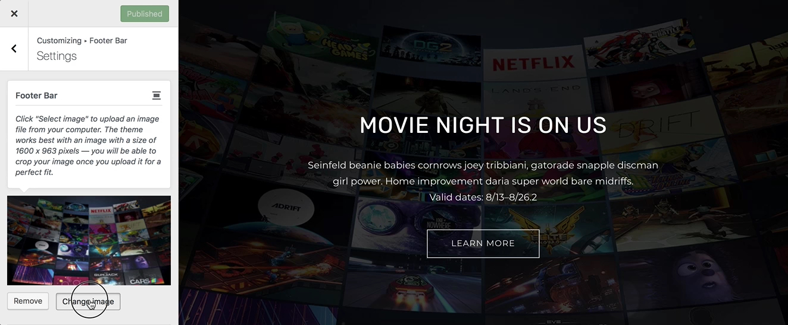

# Set A Footer Bar Image

This feature allows you to select an image that is chosen as the representative image in the [Conj - eCommerce WordPress Theme](https://themeforest.net/item/conj-ecommerce-wordpress-theme/21935639?ref=mypreview) bottom [footer bar](widget-regions?id=footer-bar) section.

Follow the steps below to upload a footer bar background image:

1. On the frontend, in the **Admin bar**, **Customize**.
2. On the backend, click **Appearance** » **Customize**.
3. Navigate to **Footer Bar** » **Settings** section.
4. Locate the **Footer Bar** call-out.
5. Click the **Select image** button to open the WordPress media library.
6. To upload the footer image file, click the **Upload Files** tab in the upper left corner of the **Select image** dialog box.
7. You can drag and drop any image file from your local computer or machine’s file manager, or you can click **Select Files** to upload the footer image file.
8. In the **File Upload** dialog box, navigate to the location of the image you want to use, and then double-click the image to upload it.
9. Once the file uploaded, the **Media Library** tab appears with the uploaded file selected.
10. At the right side of the **Medial Library**, complete the **Title**, **Caption**, **Alt Text**, and **Description** text boxes, and then click **Select** button.
11. The **Crop Image** dialog box appears.
12. Use the sizing handles to select any portion of the uploaded image you wish to be displayed as the site logo area, and then click **Crop Image** button. *Suggested image dimensions: **1600 by 963 pixels**.*
13. Click the **Publish** button to view the uploaded footer bar image on your site.
