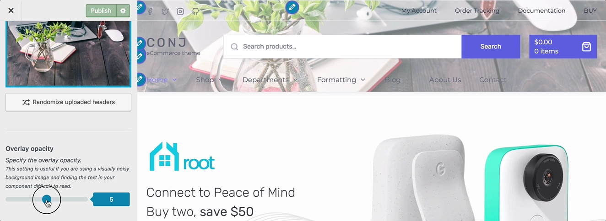
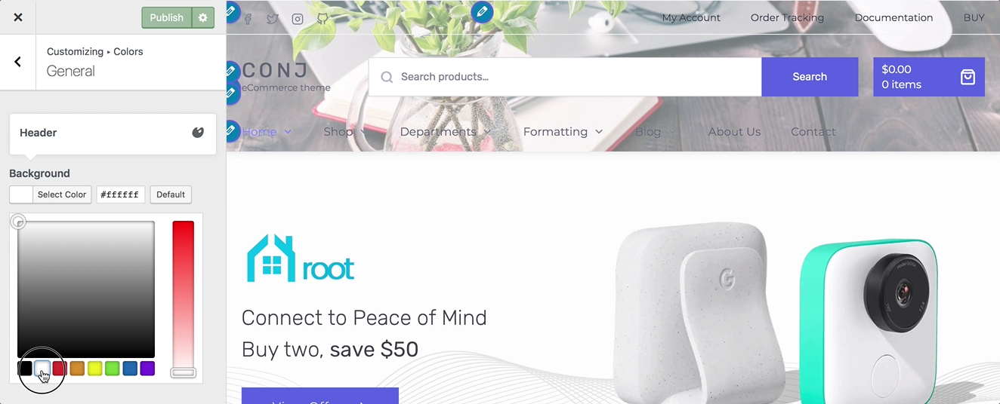

# Set A Header Image

The [Conj - eCommerce WordPress Theme](https://themeforest.net/item/conj-ecommerce-wordpress-theme/21935639?ref=mypreview) has an option which allows users to upload their very own custom image header to obtain a much more personalized look and feel.

Follow the steps below to upload a header background image:

1. On the frontend, in the **Admin bar**, **Customize**.
2. On the backend, click **Appearance** » **Customize**.
3. Navigate to **Header Image** section.
4. Locate the **Current header** image upload field.
5. Click the **Add new image** button to open the WordPress media library.
6. To upload the header image file, click the **Upload Files** tab in the upper left corner of the **Choose Image** dialog box.
7. You can drag and drop any image file from your local computer or machine’s file manager, or you can click **Select Files** to upload the header image file.
8. In the **File Upload** dialog box, navigate to the location of the image you want to use, and then double-click the image to upload it.
9. Once the file uploaded, the **Media Library** tab appears with the uploaded file selected.
10. At the right side of the **Medial Library**, complete the **Title**, **Caption**, **Alt Text**, and **Description** text boxes, and then click **Select and Crop** button.
11. The **Crop Image** dialog box appears.
12. Use the sizing handles to select any portion of the uploaded image you wish to be displayed as the site logo area, and then click **Crop Image** button. *Suggested image dimensions: **1950 by 500 pixels**.*
13. Click the **Publish** button to view the uploaded header image on your site.

!> Only `.jpeg`, `.gif`, and `.png` files can be used. All cropped images will be converted to jpegs. Using an image of exactly the right size will produce the best results, and this is certainly recommended.

## Randomize Header Images

The **Current Header** image upload field will display only the currently active header image. However, you can upload a few more images to show a variety of random images in your site header area.

Once you have uploaded a few images, they will appear under **Previously Uploaded** section. You can click on the **Randomize uploaded headers** button which allows WordPress to choose one of the uploaded images for your header area randomly.

## Adjust The Overlay Opacity

This setting is useful if you are using a visually noisy background image and finding the content in your header area difficult to read.

You can specify the overlay opacity by dragging the handle to the left or right.

## Change The Overlay Color

1. On the frontend, in the **Admin bar**, **Customize**.
2. On the backend, click **Appearance** » **Customize**.
3. Navigate to **Colors** » **General** section.
4. Locate the **Header** call-out.
5. Click on the **Background** color to change it.
6. Use the **hexadecimal value** for complete accuracy, or choose from the color picker for an approximate value.
7. Preview your selection instantly.
8. Click the **Publish** button to save the changes.

## Additional Links

* [Image Use Policy](https://en.wikipedia.org/wiki/Wikipedia:Image_use_policy)
* [Public Domain Images](https://en.wikipedia.org/wiki/Wikipedia:Public_domain_image_resources)
* [Hexadecimal Numeral System](https://simple.wikipedia.org/wiki/Hexadecimal_numeral_system)
