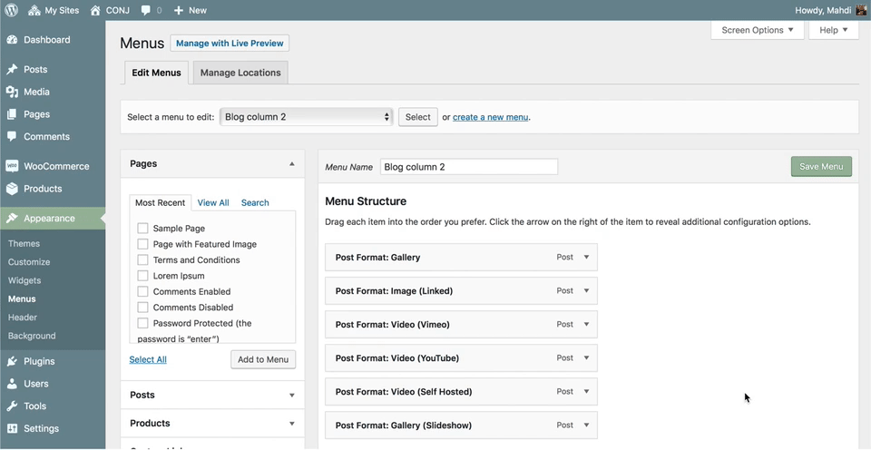
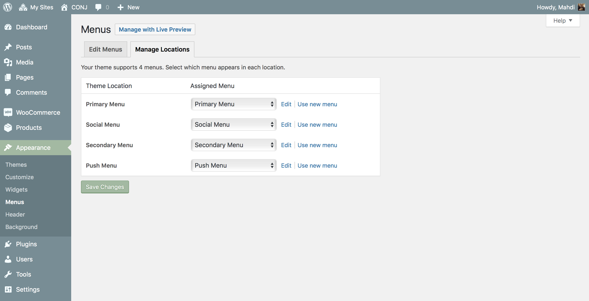

# Creating your menu

WordPress comes with easy to use menu functionality, which lets you quickly create any menus and place them in your menu areas or even in a widgetized area with the mega-menus widget.

## Defining a menu

1. Start by visiting **Appearance » Menus**.
2. Select **Create a new menu** at the top of the page.
3. Enter a name for your new menu in the **Menu Name** box.
4. Click the **Create Menu** button and your new custom menu has now been defined.

## Adding items to a menu

You can add different link types into your menu, these are split between panes left of the menu you're currently editing.

!> The **screen options** allow you to choose which items you can use to add to a menu. Certain items, like Posts are hidden by default. The screen options are located in the top right corner of your WordPress dashboard.

1. Locate the pane entitled Pages.
2. Within this pane, select the View All link to bring up a list of all the currently published pages on your site.
3. Click the Add to Menu button located at the bottom of this pane to add your selection(s) to the menu that you created in the previous step.
4. Click the Save Menu button once you've added all the menu items you want.

## Creating drop-down menus

Once an item is added to a menu, those menu items can be rearranged to create sub menu items.
To create a drop down menu **drag a menu item** slightly to the right of the menu item above it to create a sub item (parent/child) relationship in the menu.

## Deleting a menu item

1. Locate the menu item that you want to remove in the menu editor window.
2. Click on the **arrow icon** in the top right-hand corner of the menu item to expand it.
3. Click on the **Remove** link. The menu item will be immediately removed.
4. Click the **Save Menu** button to save your changes.

## Assigning your menu to a location

While creating or editing your menu, you can assign it's location at the bottom of the menu.

Also, Manage Locations tab is where you can assign all locations a menu from one screen.

1. Scroll to the bottom of the menu editor window.
2. In the section titled **display location**, as an example click the check box for the **Primary Menu** location.
3. Click **Save Menu** once you've made your selection.

## Adding product categories

To add **Product Categories** to your menu, you might need to enable them first in the **Screen Options**. Then add and organize your product categories as you would any other menu item.
