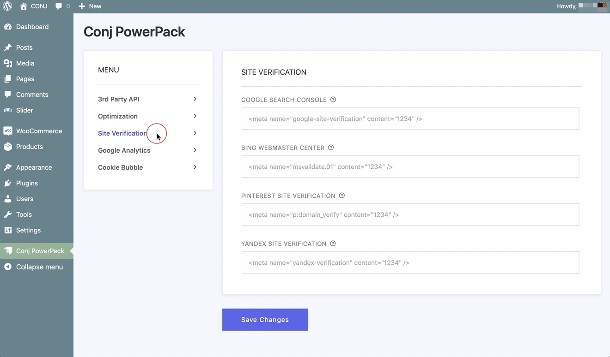

# Site Verification Tools

This feature allows website or webshop owners to have additional tools to help them verify their sites in a various platforms like **Google**, **Bing**, and **Pinterest**.



!> Please note that verifying your site in webmaster tools is **not necessary** but doing so will enable your site to be indexed with Google, Bing, or any other search engine.

For most sites, in order to verify your site for webmaster tools, you usually need to add a hidden meta tag to your page or change a DNS entry.

For most sites, to verify your site for webmaster tools, you usually need to add a hidden meta tag to your page or change a DNS entry. Since this isn’t always the easiest thing to do and in case you’re not technical, 
[Conj - eCommerce WordPress Theme’s](https://themeforest.net/item/conj-ecommerce-wordpress-theme/21935639?ref=mypreview) site verification module is here to help.

## Google Search Console

Follow the steps below to verify your WordPress site with Google Search Console:

1. First, You’ll need to sign in with a **Google account** if you’re not already logged in.
2. Navigate to [Google Search Console](https://www.google.com/webmasters/verification/home?hl=en) to get started.
3. Click on **Add a property**.
4. Enter your site address.
5. Click the **Continue** button.
6. Click on the **Alternate Methods** tab.
7. You’ll see a line of HTML code like the following:<br/>
   `<meta name="google-site-verification" content="jV5rz9P2s2wdDsnwTu4tD-gmruKUrqBGjs" />`
8. Copy the entire meta tag shown in the screen/field.
9. Leave the verification page open and go to your site dashboard *(in a new tab/window)*.
   1. Login to the your WordPress Dashboard
   2. Click the **Conj PowerPack** menu.
   3. From the sidebar on the left, select the **Site Verification** tab.
   4. Locate the **Google Search Console** text-field and paste your meta tag in.
   5. Click the **Save Changes** button.
9. Go back to Google’s verification page and click **Verify**.

### Google Warnings

In case you have received an email from Google with a subject of an alert in your **Webmaster Tools** dashboard that your site’s security certificate could not be found, this means your site was inadvertently added as a secure site. 

An example of the message you may have received:

```txt
Dear Webmaster,

The host name of your site, https://example.com, does not match any of the “Subject Names” in your SSL certificate [….]
This will cause many web browsers to block users from accessing your site, or to display a security warning message when your site is accessed.

To correct this problem, please get a new SSL certificate by a Certificate Authority (CA) with a “Subject Name” or “Subject Alternative DNS Names” that matches your host name.
```

If a message like the above arrived in your inbox, you’d need to remove the site from your **Webmaster Tools** account, and then add it back as a standard site.

1. Log in to [Google Webmaster Tools](https://www.google.com/webmasters/tools/) with your **Google account**.
2. Below the button for **Manage Site**, click **Delete Site**.
3. Click the button to **Add a Site** and follow the [instructions above](site-verification-tools?id=google-search-console).

## Bing Webmaster Center

Follow the steps below to verify your WordPress site with Bing Webmaster Center:

1. First, You’ll need to sign in with a **Live! account** if you’re not already logged in.
2. Navigate to [Bing Webmaster Center](http://www.bing.com/webmaster) to get started.
3. Click on **Add a Site**.
4. Enter your site address.
5. Click the **Submit** button.
6. You’ll see a line of HTML code like the following:<br/>
   `<meta name="msvalidate.01" content="12C1203B5086AECE94EB3A3D9830B2E" />`
7. Copy the entire meta tag shown in the screen/field.
8. Leave the verification page open and go to your site dashboard *(in a new tab/window)*.
   1. Login to the your WordPress Dashboard
   2. Click the **Conj PowerPack** menu.
   3. From the sidebar on the left, select the **Site Verification** tab.
   4. Locate the **Bing Webmaster Center** text-field and paste your meta tag in.
   5. Click the **Save Changes** button.
9. Go back to the verification page and click **Return to the Site list**.

## Pinterest Site Verification

Follow the steps below to verify your WordPress site with Pinterest Site Verification:

1. First, You’ll need to sign in with a **Pinterest account** if you’re not already logged in.
2. Navigate to [Pinterest](http://pinterest.com/) to get started.
3. Go to your profile and click the **gear** menu, then **Account Settings**.
4. Scroll down and enter your **Website** address if you haven’t already.
5. Click the **Verify Website** button.
6. A popup window will show a meta tag, which you’ll need to enter on your site.
7. You’ll see a line of HTML code like the following:<br/>
   `<meta name="p:domain_verify" content="8525e3384b3545e21f0910de21"/>`
8. Copy the entire meta tag shown in the screen/field.
9. Leave the verification page open and go to your site dashboard *(in a new tab/window)*.
   1. Login to the your WordPress Dashboard
   2. Click the **Conj PowerPack** menu.
   3. From the sidebar on the left, select the **Site Verification** tab.
   4. Locate the **Pinterest Site Verification** text-field and paste your meta tag in.
   5. Click the **Save Changes** button.
9. Go back to the verification page and click the **Finish** button.

## Yandex Site Verification
