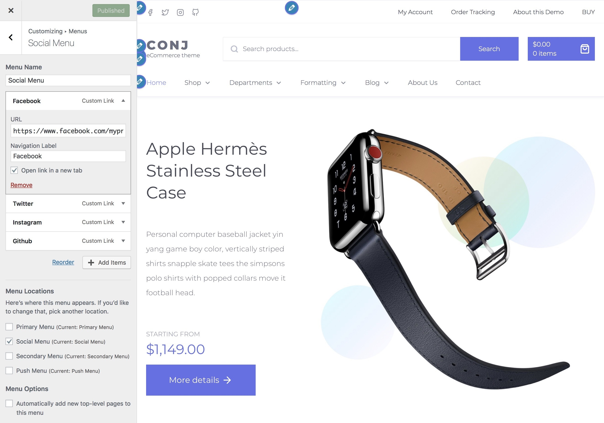

# Create a social menu

The **Social Menu** is populated in the site top bar area. Any social network icons added to the menu will automatically populate in the site header.

To add the icons, create a custom link to the social media location and theme will do the rest.

The following social media icons **are supported**:

* Gitlab
* Github
* Facebook
* Instagram
* CodePen
* Google Maps
* Slack
* Twitter
* Pocket
* E-Mail address 
*Example: mailto:info@xyz.com*
