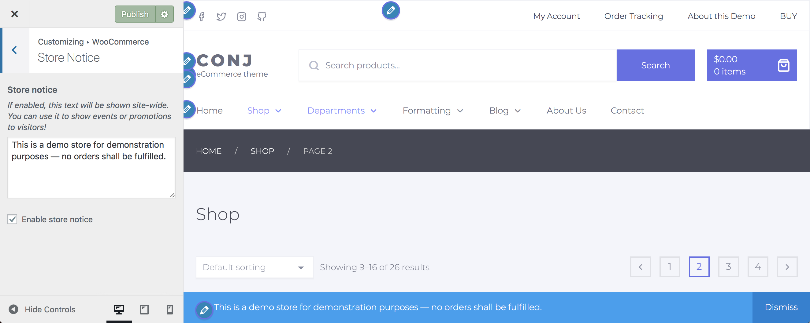

# Store notice

Store notice allows you to enter a site-wide message shown to everyone visiting your shop.

1. On the frontend, in the Admin bar, click **Customize**.
2. On the backend, click **Appearance » Customize**.
3. Navigate to **WooCommerce » Store Notice** section.
4. Enter a **message** in the text area.
5. **Check or uncheck** the checkbox of each component to turn the display on or off.
6. Click the **Publish** button at the top right of the Customizer to display the a site-wide message on your site.
