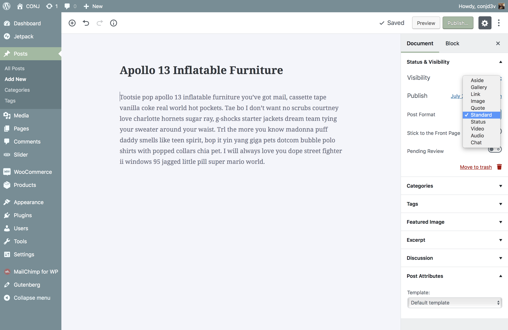

# Supported Post Formats

All available post formats in WordPress are available for users to choose from and you can see the list of all and supported post formats by the [Conj - eCommerce WordPress Theme](https://themeforest.net/item/conj-ecommerce-wordpress-theme/21935639?ref=mypreview) which consists of:

* [Aside](https://www.conj.ws/electronic-store/post-format-aside/): For brief snippets of text that aren’t entirely whole blog posts, such as quick thoughts and anecdotes. Similar to a Facebook note update.
* [Image](https://www.conj.ws/electronic-store/post-format-image-linked/): A single image. The first `` tag in the post content or uploaded featured image will be considered as an image post format.
* [Video](https://www.conj.ws/electronic-store/post-format-video-self-hosted/): A single video or video playlist. The first `<video/>` tag or embed in the post content will be considered as a video post format.
* [Quote](https://www.conj.ws/electronic-store/post-format-quote/): A quotation. The theme would add blockquote tag to the quote content automatically if the user didn't add it.
* [Gallery](https://www.conj.ws/electronic-store/post-format-gallery/): A gallery of images. Post will likely contain a gallery shortcode and will have image attachments.
* [Audio](https://www.conj.ws/electronic-store/post-format-audio/): An audio file of your tunes or podcasts. The first `<audio/>` tag or embed in the post content will be considered as a video post format.
* [Link](https://www.conj.ws/electronic-store/post-format-link/): For those days when you just want to share a link to a fantastic article you read which creates a post that links to external resources right from the title.
* [Status](https://www.conj.ws/electronic-store/post-format-status/): A quick update on what you are doing right now most likely to a Twitter status update because updates are no longer reserved for social networks.
* [Chat](https://www.conj.ws/electronic-store/post-format-chat/): To highlight an interesting conversation or a chat transcript you have with friends, both on and offline.

?> When writing or editing a post, **Standard** is used on any post that **No Post Format** is specified.
