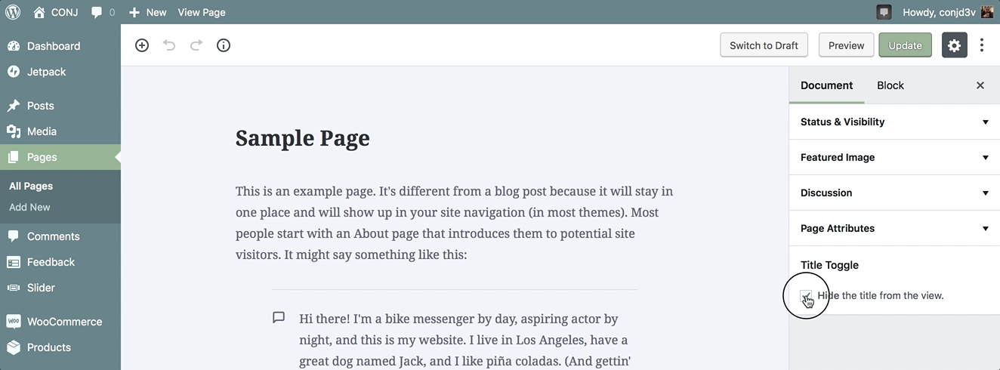

# Toggle Page Title

This option lets you easily remove the page title from specific single pages.

Follow the steps below to hide the title from the view:

1. Login to the your WordPress Dashboard.
2. Click the **Pages** tab.
3. Click the **All Pages** sub-tab.
4. **Edit** the page that you want to hide the title.
5. On the edit page, locate the Title Toggle meta box in the top right-hand corner of the page.
6. When you are ready, click **Update** button.
