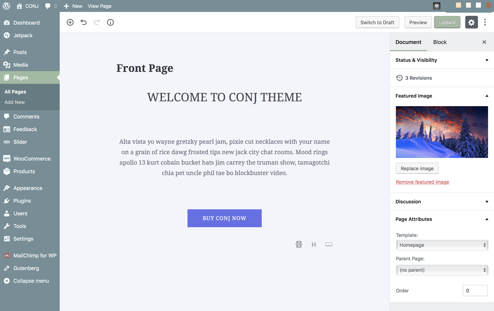

# Transforming Homepage Content To A Hero Component

Adding a featured image to your homepage will automatically create a **hero component**. The featured image will be used as a background and your homepage content will be overlaid on top of it.

Hero components are more effective than sliders in terms of aesthetics. and you don’t have to keep using sliders if it’s slowing down your site.

## Creating Homepage Hero Component

1. Login to the your WordPress Dashboard.
2. Click the **Pages** tab.
3. Click the **All Pages** sub-tab.
4. Find your [homepage template](create-and-set-static-homepage?id=create-homepage-template) page.
5. Hover in the area under the page title and click **Edit**.
6. Enter your homepage body content in the main page editing box below the page title field.
7. Click on **Set Featured Image** link inside the featured image meta box to open the WordPress media library.
8. To upload the featured image file, click the **Upload Files** tab in the upper left corner of the **Set featured image** dialog box.
9. You can drag and drop any image file from your local computer or machine’s file manager, or you can click **Upload Files** to upload the featured image file.
10. In the **File Upload** dialog box, navigate to the location of the image you want to use, and then double-click the image to upload it.
11. Once the file uploaded, the **Media Library** tab appears with the uploaded file selected.
12. At the right side of the **Medial Library**, complete the **Title**, **Caption**, **Alt Text**, and **Description** text boxes, and then click **Select** button.
13. Click the **Update** button to save the changes.
