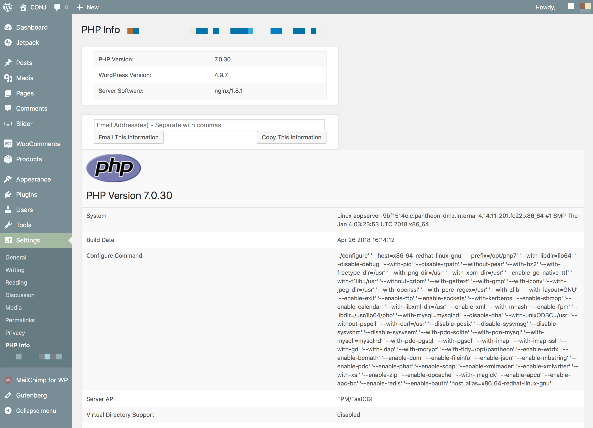

# Update Your Server PHP Version

[PHP](http://www.php.net/) is the most popular server-side scripting language, powering millions of websites including most WooCommerce shops.

!> Running your shop on an outdated and unmaintained version of PHP will definitely affect your website’s performance (a lot) lower than it should be, you may find that things do not work as you expect and be open to security vulnerabilities!

## What Is the PHP?

PHP is a scripting language which most likely powers your WordPress and WooCommerce shop. PHP, like all software, gets updated over time to patch security issues and improve its features. And like other software, it’s important to keep your PHP version up to date.

## Contact Your Service Provider

Contacting your hosting company is usually the easiest way to find out how you can update your PHP version. They probably already have newer PHP versions available, they just need to update your account.

The upgrade process is an easy process and should be something your host can do for you without impacting your website or charging you a fee.

Here’s a letter you can send to your service provider company:

```
Dear service provider,

I’m running a WooCommerce webshop on one of your servers and the Conj - eCommerce WordPress Theme has recommended using at least PHP 7.0 or above. Also, WordPress, the content management system that my theme uses, has listed PHP 7 as the recommended version on their requirements page:

https://wordpress.org/about/requirements/
https://mypreview.github.io/Conj/#/update-server-php-version?id=contact-your-service-provider

Please let me know if my hosting supports PHP 7.0 or higher and how I can upgrade?

In addition to that, please increase those limits to a minimum as follows:

max_execution_time 180
memory_limit 128M
post_max_size 64M
upload_max_filesize 64M
max_input_time 60

Looking forward to your reply.
```

You will have to ask them to be updated to a currently supported PHP version. At this moment, it’s safe to run on PHP 7.0 or 7.1, but it doesn’t hurt to get upgraded to **PHP 7.2** or higher already.

## Your Current PHP Limits

Follow the steps below in case you are a non-technical administrator and want to be able to diagnose server related problems on your own:



1. Install and activate [WordPress phpinfo()](https://wordpress.org/plugins/wordpress-php-info/) plugin.
2. Navigate to **Settings** » **PHP Info**.
3. The first table details refers to your current version of PHP installation.

## Additional Links

* [Finding Server Info](https://codex.wordpress.org/Finding_Server_Info)
* [PHP.net's phpinfo Manual](http://us3.php.net/phpinfo)
* [WordPress Server Recommendations](https://wordpress.org/about/requirements)
* [WooCommerce Server Recommendations](https://docs.woocommerce.com/document/server-requirements)
