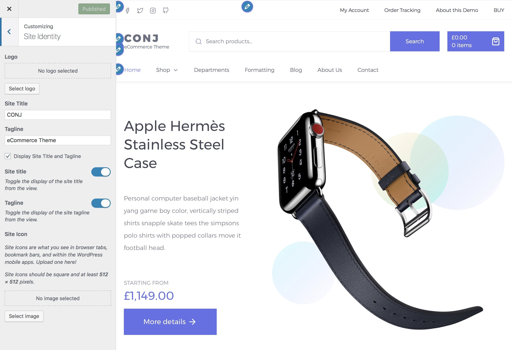
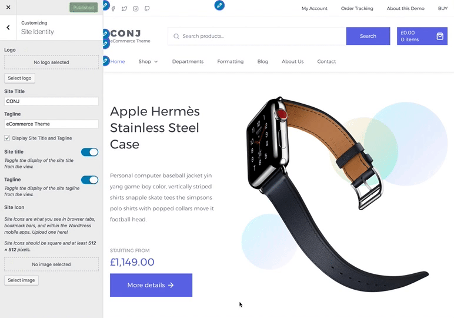

# Site logo

Follow the steps below to upload your site logo:

1. On the frontend, in the Admin bar, **Customize**.
2. On the backend, click **Appearance » Customize**.
3. Click on the **Site Identity** section.
4. Click the **Select Logo** button to open the WordPress media library.
5. Click **Select**, and you will see your logo appear in the preview window.
6. Click the **Publish** button at the top right of the Customizer to display the logo on your site.

!> Note that if the logo image is not uploaded, then your site title will be used and displayed instead.

## Changing or removing the logo

Once a logo has been set, you can change or remove it using the **Remove** and **Change Logo** buttons. Once you are satisfied, be sure to click the **Publish** button to preserve your logo settings.

## Hiding the site title and/or description

Below the **Site Logo** selection control in the Customizer, you will see a checkbox labeled Display **Site Title and Tagline**. To hide your site title and description, leaving just the logo, uncheck this box. Be sure to click **Publish** to make it active on your site.

In addition to the above, you would also be able to toggle the visibility of the site title and tagline from the view individually.
