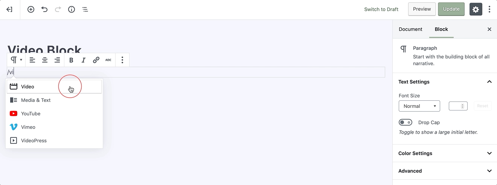
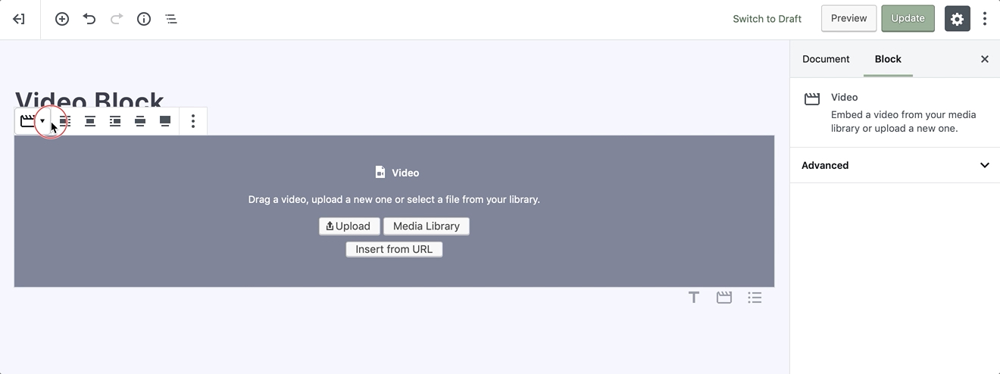
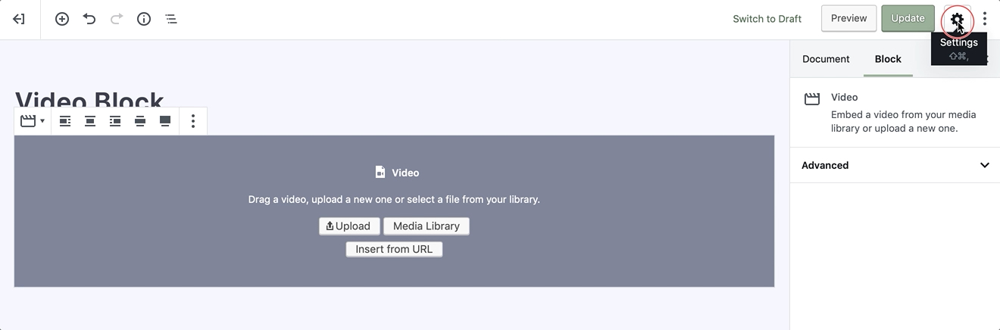
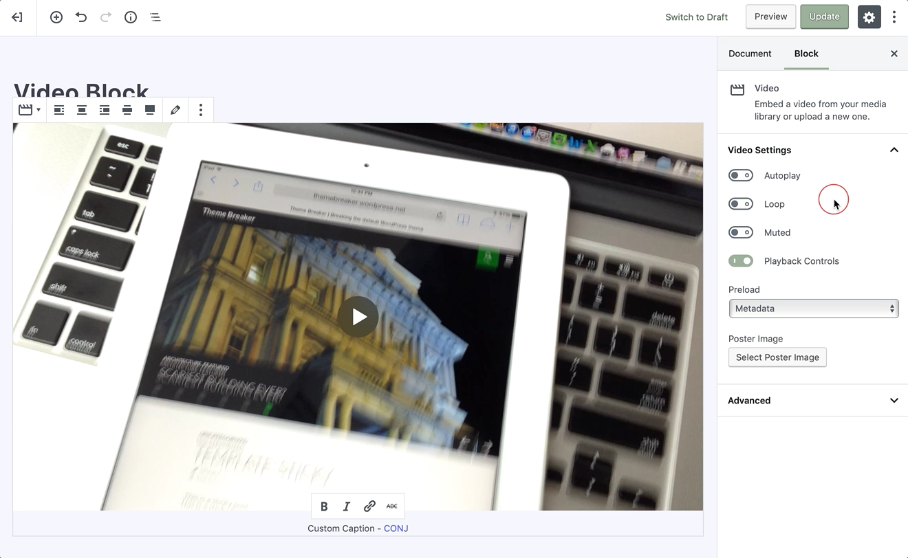

# Video Block

The video block lets you upload and embed video into your post or page.

To add an video, click on the [Add Block](adding-block) button and select the **Video** block. Alternatively, you can start typing `/video` in a new paragraph block, then press enter.

!> Detailed instructions on adding blocks can be found [here](adding-block).

## Block Interface

Every block comes with unique and block-specific controls that allow you to manipulate the block directly right in the editor. 

## Adding a Video

Upon adding an video block, you will get three options to chose from: **Upload**, **Media Library**, and **Insert from URL**.

* The **Upload** button will allow you to upload a new video file from your computer. 
* The **Media Library** button lets you select a file that’s already uploaded to your site’s Media Library. 
* **Insert from URL** button lets you input a URL where the file has already been uploaded, on a streaming service such as **Youtube**, upon inserting the URL video block will automatically transform into a Youtube block.

Right after you’ve selected the video file to insert, you can add an optional text **caption** just underneath the player and start configuring your video block.

### Alignment

A block-specific toolbar will appear whenever you select the video block. Three of the options are for the block’s alignment, right, center, and left. Choosing the **right** or **left** will allow you to place another block alongside the video block moreover picking **center** will return the block to its default, taking up the full width of the post or page content.

If you wish for the video to be emphasized on the page, the Wide and Full Alignment options will expand the video beyond the bounding column of the page, providing a cinematic experience.

### Edit Video

Choosing this option will allow you to select a new video file for the block. This option can be used to replace the current video file in the block.

## Sidebar Settings

In addition to the options found in the block’s toolbar, you may locate the block specific settings in the **editor sidebar panel**. Clicking on the **cog** icon next to the publish button will toggle the visibility of this panel.

## Autoplay, Loop, & Muted

The following options let you set your video file to autoplay when a user visits the page or post, and the looping allows you to choose if the video file needs to be repeated after it’s finished. Also, you might decide to mute the video if your case requires it.

## Playback Controls

Toggle this option to show or hide the playback control overlay on the video.

## Preload

This feature allows you to select how much of the video file is downloaded when the page or post is loaded.

!> Enabling this option might slow your page’s load speed down.

#### The following are the settings:

* **None** – Nothing about the regarding the video file is downloaded automatically. The download of the video file only begins when your visitor clicks on the **Play** button. *This might be the fastest setting.*

* **Metadata** – Only basic info about the file will be downloaded automatically. Like the **None** option, the download of the video file only begins when a user clicks on the **Play** button. This setting is also very fast, as the only thing downloaded is text or basic info regarding the file. 

* **Auto** – The entire video file is downloaded, despite whether the visitor clicks the **Play** button or not. This might make the most significant impact on your page or post’s load speed, especially with larger video files.

?> On a theoretical base, there’s not a big difference between **None** and **Metadata**.

## Poster Image

Optionally, you can choose a poster image that will be displayed prior to a video is set to **Play**, this might be useful if the first frame of the video isn’t necessarily appealing or characteristic of the video content.

## Advanced

The advanced tab lets you add a CSS class to your block, allowing you to write custom CSS and apply styles to the block as you see fit.
