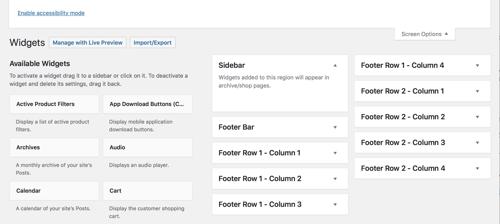
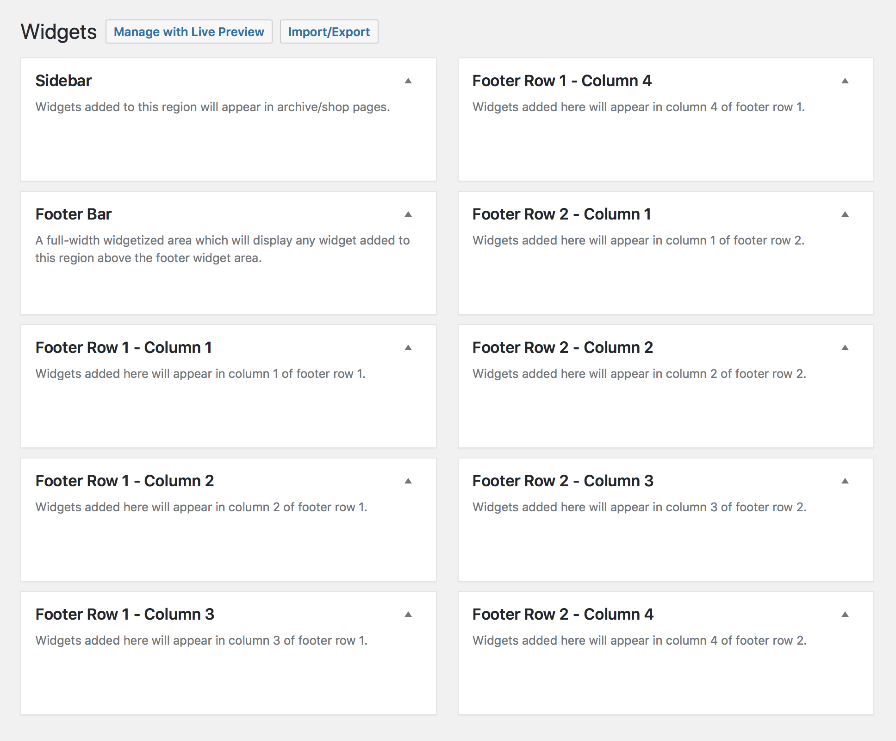

# Widget Regions 

WordPress Widgets add content and features to your sidebars. Examples are the default widgets that come with WordPress; for **Categories**, **Tag cloud**, **Search**, etc.

## Displaying Widgets

1. Log into your WordPress website and navigate to **Appearance** » **Widgets**.
2. Choose a **Widget** and either drag it to the sidebar where you wish it to appear, or click the widget, *(select a destination sidebar if your theme has more than one)* and click the **Add Widget** button.
3. Preview the site. You should now see the added widgets are visible.

## Arranging Widgets

To arrange the **Widgets** within the sidebar or widget area, click and **drag** it into place.

## Configuring Widgets

To customize the widget features, click the down **arrow** in the upper right corner to expand the widget’s interface. Then click the **Save** button to save the widget’s customization.

## Removing Widgets

To delete or remove the widget from the view, click **Delete**.

?> If you want to remove the widget but save its setting for possible future use, just **drag** it into the **Inactive Widgets** area. You can add them back anytime from there.

## Widget Visibility

This module is now enabled by default for all [JetPack](https://wordpress.org/plugins/jetpack/) users and enables you to configure widgets to appear only on specific pages (or be hidden on certain pages) by using the **Visibility** panel.

## Accessibility

There is also an **Accessibility Mode** for users who need it. To enable accessibility mode, you need to click on the **Screen Options** button at the top right corner of the screen.

## Sidebar Areas

The [Conj - eCommerce WordPress Theme](https://themeforest.net/item/conj-ecommerce-wordpress-theme/21935639?ref=mypreview) theme includes ten widget regions by default.

### Sidebar

Widgets added to this region will appear in archive (blog) and shop pages.

### Footer Bar

A full-width widgetized region which will display any widget added to this region above the footer widget area.

### Footer x 8

All footer widget regions are arranged into equal width columns dependent on how many regions are active. 

As an example if you have widgets in the **Footer Row 1 - Column 1** region and widgets in the **Footer Row 1 - Column 2** region, they are organized in two equal-width columns while column 3 and 4 won’t display in that row.

## Additional Links

* [WordPress Widgets](https://codex.wordpress.org/WordPress_Widgets)
* [Using Text Widgets](https://codex.wordpress.org/WordPress_Widgets#Using_Text_Widgets)
* [Widget Visibility](https://jetpack.com/support/widget-visibility)
