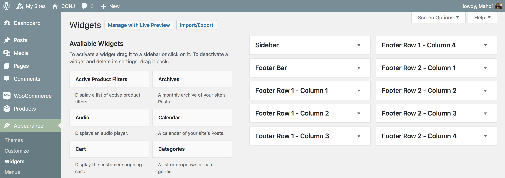
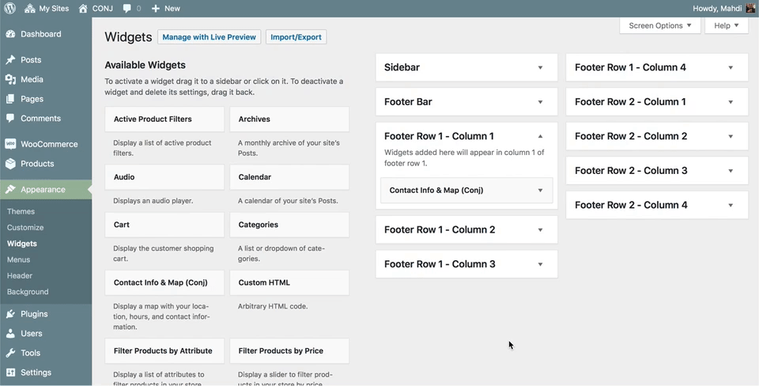

# Widget regions 

Conj theme includes ten widget regions.

?> Widgets can be found on **Appearance » Widgets** page in your WordPress admin area.

## Sidebar

Widgets added to this region will appear in archive (blog) and shop pages.

## Footer bar

A full-width widgetized region which will display any widget added to this region above the footer widget area.

## Footer x 8

All footer widget regions are arranged into equal width columns dependent on how many regions are active. As an example if you have widgets in the **Footer Row 1 - Column 1** region and widgets in the **Footer Row 1 - Column 2** region, they are organized in two equal-width columns while column 3 and 4 won’t display in that row.

## Adding widget to a sidebar

There are several ways to add widgets to sidebars available in theme. The easiest one is to simply drag and drop them to your widget region.

You can also click on a widget title from the list of available widget. WordPress will show you the list of widget regions where you can add this widget.

Simply select the widget region where you want to add the widget, and then click on **Add Widget** button to add it.

?> There is also an **accessibility mode** for users who need it. To enable accessibility mode, you need to click on the **screen options** button at the top right corner of the screen.
