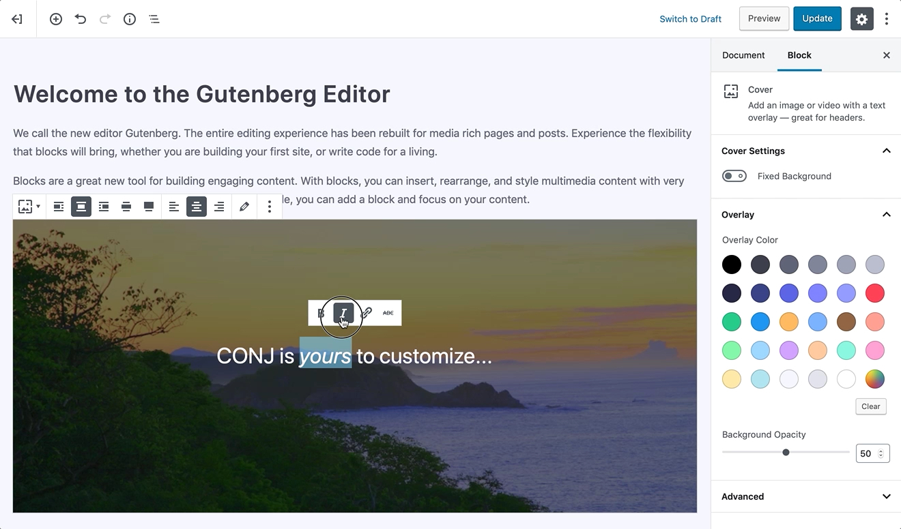

# WordPress Editor

Within the [WordPress version 5.0](https://wordpress.org/news/2018/12/bebo/) release, the entire editing experience of the posts and pages have been rebuilt to offer a genuine solution for creating media-rich content and control the adjustment of your layout with ease.

The editor takes all the worrying about the alignment and organization of content, quotes, and images, etc. and offers a flexible experience based on blocks so you can focus on creating engaging content instead.

The fact that every single element in the page has its own block won’t change the way any of your content looks to your visitors preferably this feature enables you to insert any type of component or multimedia and move, edit, or even customize each one of them super fast.

[Conj - eCommerce WordPress Theme](https://themeforest.net/item/conj-ecommerce-wordpress-theme/21935639?ref=mypreview) offers tons of [built-in blocks](https://mypreview.github.io/Conj/#/?id=gutenberg-blocks), and while maintaining a consistent look and feel of your page, it displays visual elements the way they’ll look on your actual site. This lets you save more of your time which you may have previously spent previewing and double-checking your content before hitting the Publish button. 

## Additional Links

* [WordPress 5.0 “Bebo”](https://wordpress.org/news/2018/12/bebo/)
* [Editor Technical Overview](https://make.wordpress.org/core/2017/01/17/editor-technical-overview/)
