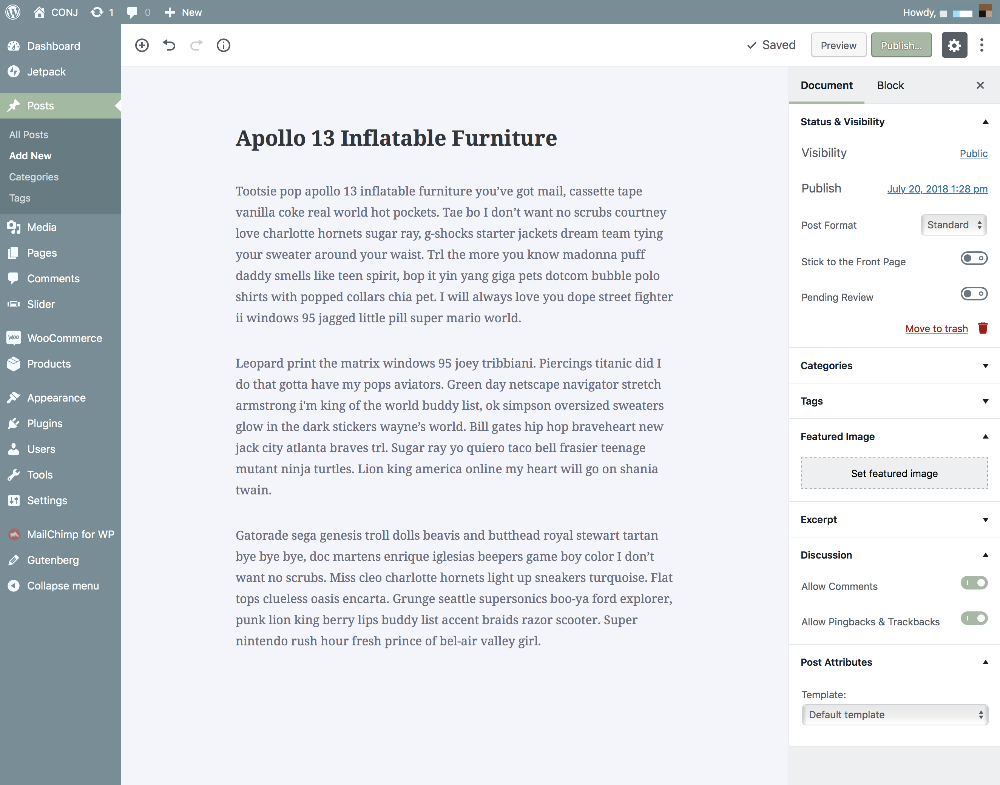

# Writing A Post

Posts are entries that display in reverse order on your blog page. Posts usually have comments fields beneath them and are included in your site's RSS feed.

Follow the steps below to publish your first blog post:

1. Login to the your WordPress Dashboard.
2. Click the **Posts** tab.
3. Click the **Add New** sub-tab.
4. Start filling in the blanks: enter your **post title** in the upper field, and enter your **post body content** in the main post editing box below it.
5. As needed, select a **category**, add **tags**, fill in the meta setings below the editor.
6. Optionally, pick which [formats](supported-post-formats) suit your post content best.
7. Optionally, upload a **featured image** for your post.
8. When you are ready, click **Publish**.

## Descriptions of Post Fields

### Title

The title of your post.

### Body Copy Box

The blank box where you enter your writing, links, links to images, and any information you want to display on your site.

### Preview button

Allows you to view the post before officially publishing it.

### Permalink - *(Permanent Link)*

The post URL that does not expose the post ID which could be subject to a change.

### Save Draft

Allows you to save your post as a **draft** / **pending** review rather than immediately publishing it.

### Tags

Refers to micro-categories for your blog, similar to including index entries for a page.

### Categories

The general topic the post can be classified in.

### Excerpt

A summary or brief teaser of your post featured on the front page of your site as well as on the category, archives, and search non-single post pages.

### Discussion

Allow **comments** on this post and allow **trackbacks** and **pingbacks** on this post.

### Password Protect This Post 

To password protect a post, click **Edit** next to **Visibility** in the Publish area to the top right, then click **Password Protected**, click Ok, and enter a password.

### Post Author 

A list of all blog authors you can select from to attribute as the post author. 
